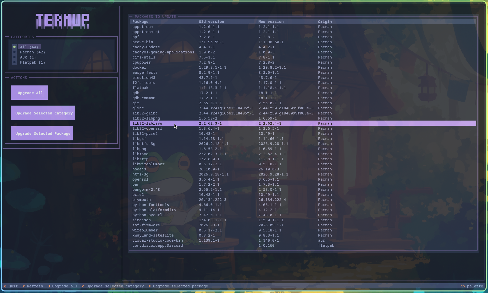

# termup

<div align="center">
    
</div>

`termup` es una interfaz de usuario para la terminal (TUI) desarrollada con
Python y [Textual](https://textual.textualize.io/). Está orientada a Arch Linux
y distribuciones derivadas, y permite consultar desde una sola pantalla las
actualizaciones disponibles para los paquetes administrados por `pacman`, el
AUR y Flatpak.

La aplicación consulta las tres fuentes de forma asíncrona y muestra el nombre
del paquete, la versión instalada, la nueva versión y su origen. Las
actualizaciones pueden filtrarse por categoría o visualizarse todas juntas.
También incluye acciones para actualizar todos los paquetes, una categoría o
un paquete seleccionado. Las acciones de actualización se abren en una nueva
ventana de `kitty` para que los comandos interactivos de `pacman`, `paru` y
Flatpak puedan ejecutarse normalmente.

## Características

- Consulta actualizaciones de repositorios oficiales mediante `checkupdates`.
- Consulta actualizaciones del AUR mediante `paru`.
- Consulta actualizaciones de Flatpak mediante `flatpak`.
- Filtrado por `pacman`, AUR, Flatpak o todas las fuentes.
- Contadores de actualizaciones por categoría.
- Actualización global, por categoría o por paquete.
- Atajos de teclado para navegar y actualizar la información.

## Requisitos

- Arch Linux o una distribución derivada.
- Python 3.14 o superior.
- `uv` para crear el entorno e instalar las dependencias de Python.
- `pacman-contrib`, que proporciona `checkupdates`.
- `paru`, necesario para consultar y actualizar paquetes del AUR.
- `flatpak`, necesario porque se consulta durante el arranque y se usa para
  actualizar aplicaciones Flatpak.
- `kitty`, utilizado para abrir los comandos de actualización.

En Arch Linux, las herramientas del sistema pueden instalarse con:

```bash
sudo pacman -S --needed pacman-contrib paru flatpak kitty
```

## Descargar el proyecto

Clona el repositorio y entra en su directorio:

```bash
git clone https://github.com/brianrscode/termup.git
```

```bash
cd termup
```

También puedes descargar el proyecto como archivo ZIP desde el repositorio,
extraerlo y ejecutar los comandos siguientes desde la carpeta del proyecto.

## Instalar y ejecutar

Sincroniza las dependencias definidas en `pyproject.toml` y fijadas en
`uv.lock`:

```bash
uv sync
```

Inicia la aplicación con:

```bash
uv run python main.py
```

Si el entorno virtual ya está activo, también puedes ejecutarla directamente:

```bash
python main.py
```

## Controles

- `q`: salir.
- `r`: volver a consultar las actualizaciones.
- `u`: actualizar todos los paquetes.
- `c`: actualizar la categoría seleccionada.
- `s`: actualizar el paquete seleccionado.
- Flechas o Tab: navegar por los controles de la interfaz.

## Estructura del proyecto

- `main.py`: aplicación principal y composición de la interfaz Textual.
- `parsers/`: lectores de actualizaciones para Pacman, AUR y Flatpak.
- `screens/`: ventanas de confirmación para las acciones de actualización.
- `styles/main.tcss`: estilos de la interfaz.
- `models.py`: modelo de datos de los paquetes.
- `commands.py`: ejecución asíncrona de comandos del sistema.

## Notas

`termup` ejecuta comandos locales del sistema y requiere que las herramientas
correspondientes estén disponibles en el `PATH`. El uso de las acciones de
actualización puede solicitar permisos de administrador mediante `sudo`.
